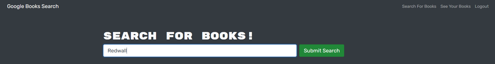
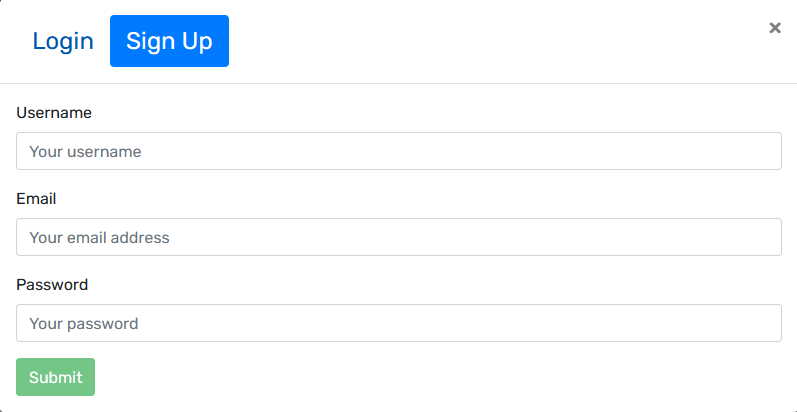
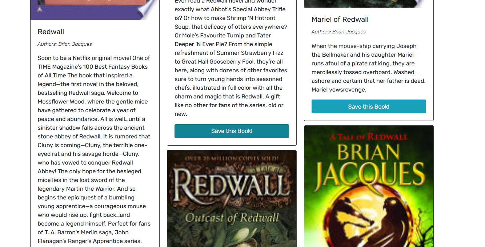
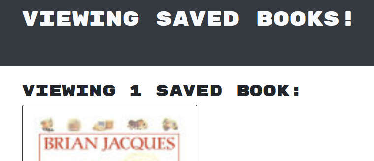
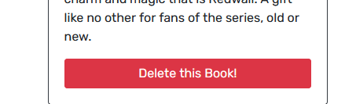

[](https://opensource.org/licenses/MIT)
# Table of Contents

[Description](#Description)

[Installation](#Installation)

[Usage](#Usage)

[Links](#Links)

[Questions](#Questions)


# Description
```
A tool used to look up and save books using the Google Books API.
```
- Demonstrates CRUD operations via queries and mutations utilizing Apollo and GraphQL
- Utilizes Mongoose to work with MongoDB hosted via Atlas (when deployed)
# Installation
```
If you don't already have node.js, install node.js
Navigate to the project directory via a command line interface such as bash, powershell, or zshell
```
```
Use the command 'npm install' to install dependencies from the package.json with version control from package-lock.json
Still using the CLI, use the command 'npm run build' to build the client
```
# Usage
```
Locally:
--------
Use a command line interface to navigate to the project folder
To start the application, run the command 'npm run develop'
You will be able to use the application via a browser by visiting localhost:3000
You can use the GraphQL interface by visiting localhost:3001/graphql
```
```
Deployed:
---------
https://damp-beyond-35593.herokuapp.com/
```
```
Right out the gate, you can utilize the search functionality, but will not be able to save any books.
```

```
On the top right of the page, there is the login/signup section. First, you'll want to create an account there.
```

```
After creating an account, you can fully utilize the search function.
```

```
You can view saved books by clicking the 'See Your Books' button in the top right in the navigation bar. This will redirect you to a page that shows your saved books.
```

```
While viewing your saved books, each one has a button to delete it from your saved books.
```

# Links
If you would like to contribute to the project, it can be found here: [booksearch](https://github.com/tperschon/booksearch)
To view the application fully deployed, visit it here: [booksearch deployed](https://damp-beyond-35593.herokuapp.com/)
# Questions
If you have any questions, I can be reached via: [Github](github.com/tperschon) and [E-Mail](timperschon@gmail.com)